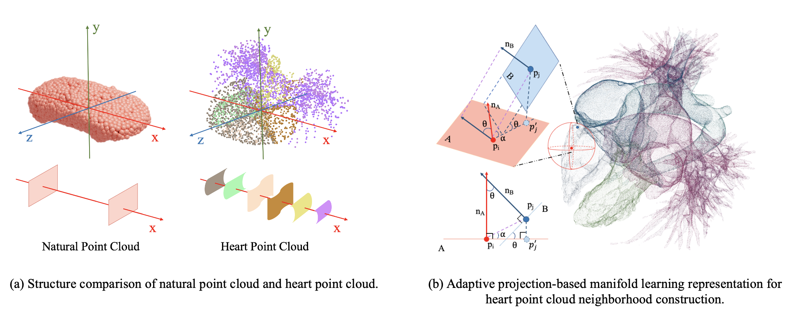

# PointCHD
PointCHD: A Point Cloud Benchmark for Congenital Heart Disease Classification and Segmentation

**Authors:** Dinghao Yang, Wei Gao

**Notes:** Since this work is under reivew, please contact [dinghowyang@gmail](mailto:dinghowyang@gmail ) for the dataset download, and the code will be released soon.

## Abstract

Congenital heart disease (CHD) is one of the most common birth defects. With the development of medical imaging analysis technology, medical image analysis for CHD has become an important research direction. Due to the lack of data and the difficulty of labeling, CHD datasets are scarce. Previous studies focused on CT and other medical image modes, while point cloud is still unstudied. As a representative type of 3D data, point cloud can intuitively model organ shapes, which has obvious advantages in medical analysis and can assist doctors in diagnosis. However, the production of a medical point cloud dataset is more difficult than that of an image, and the 3D modeling of internal organs needs to be reconstructed after scanning by high-precision instruments. We proposes PointCHD, the first point cloud dataset for CHD diagnosis, with a large number of high precision-annotated and wide-categorized data. PointCHD includes different types of three-dimensional data with varying degrees of distortion, and supports multiple analysis tasks, *i.e.* classification, segmentation, reconstruction, etc. We also construct a benchmark on PointCHD with the goal of medical diagnosis, we design the analysis process and compare the performances of the mainstream point cloud analysis methods. In view of the complex internal and external structure of the heart point cloud, we propose a point cloud representation learning method based on manifold learning. By introducing normal lines to consider the continuity of the surface to construct a manifold learning method of the adaptive projection plane, fully extracted the structural features of the heart, and achieved the best performance on each task of the PointCHD benchmark. Finally, we summarize the existing problems in the analysis of the CHD point cloud and prospects for potential research directions in the future.

## Dataset Overview

- 110 individual samples, a total of 187 disease samples
- The number of points for each sample is within [300k, 2130k]
- Providing a variety 3D data types such as grid, point cloud, and distroted point cloud.
- 8 common CHD types and 8 less common CHD types
- 5 heart structure segmentation


## Benchmark

### Manifold Learning-based Representation Learning



### Mainstream Methods Comparison

#### Part Segmetation

**Method** | **Pub.** | **mA** (%) |**oA (%)** | **IoU (%)** | **Dice (%)** 
:----- | :----: | :----:  | :----:  | :----:| :----: 
 [PointNet](https://openaccess.thecvf.com/content_cvpr_2017/papers/Qi_PointNet_Deep_Learning_CVPR_2017_paper.pdf) |   CVPR'17   |    46.4    |    35.2    |    20.8     |     34.4     
 [PointNet++](https://proceedings.neurips.cc/paper/2017/file/d8bf84be3800d12f74d8b05e9b89836f-Paper.pdf) | NeurIPS'17  |    49.5    |    39.2    |    31.7     |     48.1     
 [SO-Net](https://openaccess.thecvf.com/content_cvpr_2018/papers/Li_SO-Net_Self-Organizing_Network_CVPR_2018_paper.pdf) |   CVPR'18   |    49.7    |    39.9    |    32.2     |     48.7     
[PointCNN](https://proceedings.neurips.cc/paper/2018/file/f5f8590cd58a54e94377e6ae2eded4d9-Paper.pdf) |NeurIPS'18 |    55.1    |    51.8    |    34.7     |     52.4     
[DGCNN](https://dl.acm.org/doi/pdf/10.1145/3326362) | ACM TOG'19  |    54.9    |    50.5    |    34.5     |     51.3     
[PointTransformer](https://openaccess.thecvf.com/content/ICCV2021/papers/Zhao_Point_Transformer_ICCV_2021_paper.pdf) |   ICCV'21   |    55.6    |    53.1    |    35.0     |     51.9     
[PointManifold](https://dl.acm.org/doi/10.1145/3539611) |ACM TOMM'22 | 57.7 | 52.3 | 36.6 |53.6 
PointManifoldv2 (Ours) |Preprint | 60.1 | 55.2 | 39.5 |56.5 

#### Multi-label Classification

| **Method**                                                   |  **Pub.**   | **Accuracy** (%) |
| :----------------------------------------------------------- | :---------: | :--------------: |
| [PointNet](https://openaccess.thecvf.com/content_cvpr_2017/papers/Qi_PointNet_Deep_Learning_CVPR_2017_paper.pdf) |   CVPR'17   |       17.1       |
| [PointNet++](https://proceedings.neurips.cc/paper/2017/file/d8bf84be3800d12f74d8b05e9b89836f-Paper.pdf) | NeurIPS'17  |       19.5       |
| [SO-Net](https://openaccess.thecvf.com/content_cvpr_2018/papers/Li_SO-Net_Self-Organizing_Network_CVPR_2018_paper.pdf) |   CVPR'18   |       14.6       |
| [PointCNN](https://proceedings.neurips.cc/paper/2018/file/f5f8590cd58a54e94377e6ae2eded4d9-Paper.pdf) | NeurIPS'18  |       16.6       |
| [DGCNN](https://dl.acm.org/doi/pdf/10.1145/3326362)          | ACM TOG'19  |       19.5       |
| [PointTransformer](https://openaccess.thecvf.com/content/ICCV2021/papers/Zhao_Point_Transformer_ICCV_2021_paper.pdf) |   ICCV'21   |       22.0       |
| [PointManifold](https://dl.acm.org/doi/10.1145/3539611)      | ACM TOMM'22 |       22.0       |
| PointManifoldv2 (Ours)                                       |  Preprint   |       26.8       |

## Citation

```
@misc{yang2023pointchd,
      title={PointCHD: A Point Cloud Benchmark for Congenital Heart Disease Classification and Segmentation}, 
      author={Dinghao Yang and Wei Gao},
      year={2023},
      publisher = {GitHub},
      journal = {GitHub repository},
      howpublished = {\url{https://github.com/Dinghow/PointCHD}},
}
```

## Acknowledgement

The dataset source of PointCHD is based on [ImageCHD](https://github.com/XiaoweiXu/ImageCHD-A-3D-Computed-Tomography-Image-Dataset-for-Classification-of-Congenital-Heart-Disease), following the CC-BY license.
